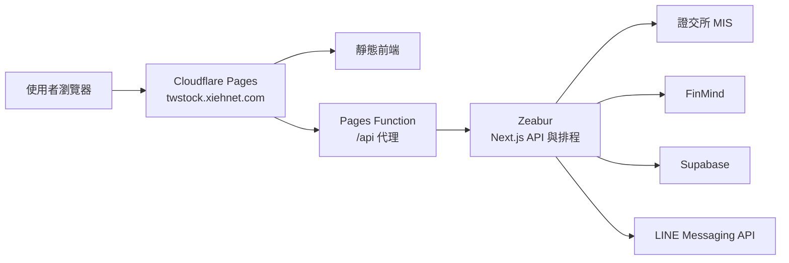

# 台股追蹤

一套以「快速掌握自選股狀態」為核心的台股追蹤工具，整合即時行情、技術圖表、基本面、法人動向、收盤摘要與 LINE 到價通知，並支援手機安裝與離線瀏覽。

> **正式網站：** [twstock.xiehnet.com](https://twstock.xiehnet.com)
>
> **後端備援入口：** [tw-stock-tracker.zeabur.app](https://tw-stock-tracker.zeabur.app)

## ✨ 核心功能

### 即時行情與大盤

- 串接證交所 MIS 行情，交易時段每 10 秒自動更新。
- 集中呈現成交價、漲跌幅、成交量與更新時間，並採台股「紅漲綠跌」配色。
- 提供加權、櫃買等市場指數、近 20 日走勢，以及自選股排序與篩選。

### 自選股管理

- 可用股票代號或名稱搜尋、新增與刪除自選股。
- 支援拖曳排序、條件篩選與行動裝置滑動操作。
- 設定可保存至 Supabase；未設定雲端服務時，會改用本機 JSON 儲存。

### 個股圖表與基本面

- 提供日、週、月 K 線與不同觀察區間，搭配成交量、均線及布林通道。
- 整合本益比、股價淨值比、殖利率、月營收、EPS 與三大法人買賣超。
- 使用 Lightweight Charts 呈現互動式圖表，方便快速切換與比對。

### 站內收盤總覽

- 收盤後彙整大盤表現、自選股漲跌家數、當日與近一週變化。
- 自動整理強弱勢個股、技術訊號與已觸發提醒，減少逐檔檢查時間。

### 到價提醒與 LINE 通知

- 可設定突破價、跌破價、漲跌幅與成交量等提醒條件。
- 排程服務定期檢查條件，觸發後可透過 LINE Messaging API 推播。
- 站內可管理提醒狀態並查看觸發結果。

### PWA 與行動裝置支援

- 可安裝至手機主畫面，提供接近原生 App 的操作體驗。
- 支援離線提示、底部導覽與觸控友善操作。
- 介面以清楚對比、可讀字級與至少 44 px 的主要觸控區域為基準。

## 🧭 系統如何運作



| 層級 | 使用技術 | 主要用途 |
| --- | --- | --- |
| 前端 | Next.js、React、Tailwind CSS、Lightweight Charts | 儀表板、圖表、PWA 與互動操作 |
| 邊緣層 | Cloudflare Pages、Pages Functions | 靜態網站與 `/api/*` 反向代理 |
| 後端 | Next.js Route Handlers、Node.js | 行情整合、摘要、提醒與排程 |
| 資料層 | Supabase 或本機 JSON | 自選股、提醒與通知紀錄 |

## 🚀 本機快速啟動

需求：Node.js 22 以上版本。

```bash
npm install
cp .env.local.example .env.local
npm run dev
```

開啟 [http://localhost:3000](http://localhost:3000) 即可使用。若未設定 Supabase，系統會自動使用 `.data/` 目錄內的本機 JSON 檔案；若需要 FinMind 或 LINE 功能，再補上對應金鑰即可。

## 🔐 環境變數

| 變數 | 必要性 | 用途 |
| --- | --- | --- |
| `NEXT_PUBLIC_SUPABASE_URL` | 選用 | Supabase 專案網址；設定後啟用雲端資料儲存 |
| `SUPABASE_SERVICE_ROLE_KEY` | 選用 | 後端存取 Supabase，禁止放入前端或提交至 Git |
| `FINMIND_TOKEN` | 選用 | 取得歷史行情、基本面與法人資料 |
| `LINE_CHANNEL_ACCESS_TOKEN` | 選用 | 傳送 LINE 到價通知 |
| `LINE_TARGET_USER_ID` | 選用 | LINE 通知接收者 ID |
| `APP_ACCESS_PASSWORD` | 正式環境建議 | 限制網站存取 |
| `HEALTH_DETAIL_TOKEN` | 正式環境建議 | 保護健康檢查的詳細資訊 |
| `APP_BASE_URL` | 選用 | 提醒訊息使用的網站網址 |

`NEXT_PUBLIC_*` 變數會在前端建置時寫入產物；Cloudflare Pages 必須在建置環境中設定。所有私密金鑰只應存在後端環境變數，不可提交至版本庫。

## 🛠️ 常用指令與驗收

| 指令 | 用途 |
| --- | --- |
| `npm run dev` | 啟動本機開發環境 |
| `npm test` | 執行單元與整合測試 |
| `npm run build` | 建置 Zeabur 使用的 Next.js 版本 |
| `npm run start` | 啟動正式模式伺服器 |
| `npm run smoke` | 長時間檢查證交所 MIS 行情穩定性 |
| `cd frontend && npm run build` | 建置 Cloudflare Pages 靜態版本 |

部署前至少應確認測試、根目錄建置及 `frontend` 靜態建置皆成功；`npm run smoke` 用於行情來源穩定性檢查，不等同完整功能測試。

## ☁️ 部署方式

專案採同一個 GitHub `main` 分支，同步驅動兩個部署平台：

### Cloudflare Pages：正式前端

- 專案根目錄：`frontend`
- 建置指令：`npm run build`
- 輸出目錄：`out`
- 正式網域：[twstock.xiehnet.com](https://twstock.xiehnet.com)
- Pages Function 會將 `/api/*` 請求轉送至 Zeabur 後端。

### Zeabur：API、排程與備援網站

- 專案根目錄：版本庫根目錄
- 建置與執行：依 `package.json` 的 `build`、`start` 指令
- 主要負責行情 API、資料整合、提醒檢查與排程工作。
- 備援入口：[tw-stock-tracker.zeabur.app](https://tw-stock-tracker.zeabur.app)

推送至 GitHub `main` 後，兩個平台會各自依設定重新建置。部署前請先確認環境變數完整，且 build／test 均為綠燈。

## 🛡️ 資料與安全

- 即時行情主要取自證交所 MIS；歷史與基本面資料由 FinMind 補充。
- Supabase 使用 `service_role` 從後端存取，不將私密金鑰暴露給瀏覽器。
- 詳細健康資訊需使用 `HEALTH_DETAIL_TOKEN`；API 錯誤回應避免回傳內部例外內容。
- 本專案提供資料整理與追蹤功能，資訊可能因來源延遲或中斷而不完整，不構成投資建議。

---

若網站顯示的行情與交易所資訊不一致，請以臺灣證券交易所及櫃買中心公告為準。
