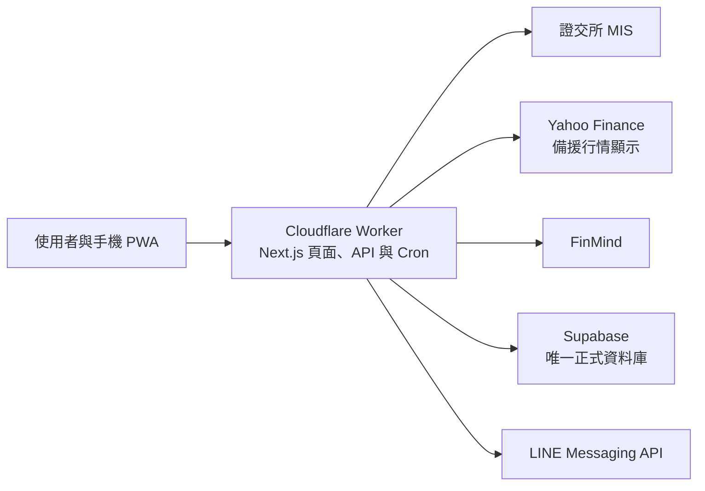

# 台股追蹤

一套以「快速掌握自選股狀態」為核心的台股追蹤工具，整合即時行情、技術圖表、基本面、法人動向、收盤摘要與 LINE 到價通知，並支援手機安裝與離線瀏覽。

> **正式環境：** [twstock.xiehnet.com](https://twstock.xiehnet.com) 已由 Cloudflare Worker 提供前端、API、Cron 與 LINE 通知，Supabase 是唯一正式資料庫。舊 Cloudflare Pages 的 Zeabur API 代理已停用。

## ✨ 核心功能

### 即時行情與大盤

- 串接證交所 MIS 行情，交易時段每 10 秒自動更新。
- MIS 暫時無法連線時，改用 Yahoo Finance 備援顯示行情；畫面依來源實際報價時間標示來源、資料日期與可能延遲，兩個來源皆無法使用時顯示最近快照。
- 報價缺漏時明確顯示不完整狀態；Yahoo 成交量在取得官方單位證據前顯示未知，不推算為「張」。
- 集中呈現成交價、漲跌幅、成交量與更新時間，並採台股「紅漲綠跌」配色。
- 提供加權、櫃買等市場指數、近 20 日走勢，以及自選股排序與篩選。

### 自選股管理

- 可用股票代號或名稱搜尋、新增與刪除自選股。
- 支援拖曳排序、條件篩選與行動裝置滑動操作。
- 設定可保存至 Supabase；未設定雲端服務時，會改用本機 JSON 儲存。

### 個股圖表與基本面

- 提供日、週、月 K 線與不同觀察區間，搭配成交量、均線及布林通道。
- 整合本益比、股價淨值比、殖利率、月營收、EPS 與三大法人買賣超。
- 使用 Lightweight Charts 呈現互動式圖表，方便快速切換與比對。

### 站內收盤總覽

- 收盤後彙整大盤表現、自選股漲跌家數、當日與近一週變化。
- 自動整理強弱勢個股、技術訊號與已觸發提醒，減少逐檔檢查時間。
- 摘要只採用來源日期可確認屬於當日的實際成交，畫面標示來源、行情時間及缺漏；每日 LINE 收盤總覽只接受完整 MIS 當日收盤資料。
- 缺少完整可信的開高低收或成交量時，保留行情、漲跌家數與排名，但不合成當日 K 線或產生新技術訊號。

### 到價提醒與 LINE 通知

- 可設定突破價、跌破價、漲跌幅與成交量等提醒條件。
- 排程服務定期檢查條件，觸發後可透過 LINE Messaging API 推播。
- 盤中到價提醒只使用完整的 MIS 報價批次，再逐檔確認當日、已實際成交、來源時間有效及不超過 120 秒；日期或時間缺漏、過舊的股票各自跳過，其他有效股票仍可觸發。13:35 的收盤總覽採完整 MIS 當日收盤資料，不套用盤中到價的 120 秒門檻；略過時記錄股票代號與原因。Yahoo 備援及舊快照僅供畫面查看，不觸發 LINE 通知。
- 站內可管理提醒狀態並查看觸發結果。

### PWA 與行動裝置支援

- 可安裝至手機主畫面，提供接近原生 App 的操作體驗。
- 支援離線提示、底部導覽與觸控友善操作。
- 介面以清楚對比、可讀字級與至少 44 px 的主要觸控區域為基準。

## 🧭 系統如何運作



| 層級 | 使用技術 | 主要用途 |
| --- | --- | --- |
| 前端 | Next.js、React、Tailwind CSS、Lightweight Charts | 儀表板、圖表、PWA 與互動操作 |
| 後端 | Next.js Route Handlers、OpenNext for Cloudflare | 行情整合、摘要與提醒 |
| 排程 | Cloudflare Cron Triggers | 到價提醒、收盤摘要、K 線補資料與 keep-alive |
| 資料層 | Supabase PostgreSQL | 唯一正式資料庫，保存自選股、提醒、快取與排程狀態 |

正式環境只使用 Supabase 持久化資料。專案中的本機 JSON 模式僅供本機開發；Cloudflare Workers 的檔案系統不持久，不得當成正式儲存。

根目錄的 `app/`、`lib/` 與 `cloudflare-worker.ts` 是正式 Worker 使用的專案。`frontend/` 保留舊 Cloudflare Pages 的靜態匯出外殼，部分頁面共用根目錄程式；目前正式流量由根目錄 Worker 承接。維護共用頁面時須確認根目錄與舊外殼的引用關係。

## 🚀 本機快速啟動

需求：Node.js 22 以上版本。

```bash
npm ci
cp .env.local.example .env.local
npm run dev
```

開啟 [http://localhost:3000](http://localhost:3000) 即可使用。本機未設定 Supabase 時，部分儲存功能會使用 `.data/` 目錄的 JSON 檔案；這項 fallback 不適用於 Cloudflare Worker 正式環境。

## 🔐 環境變數

| 變數 | 必要性 | 用途 |
| --- | --- | --- |
| `NEXT_PUBLIC_SUPABASE_URL` | Worker 必要 | Supabase 專案網址；同時提供給 Next.js 建置與 Worker runtime |
| `SUPABASE_SERVICE_ROLE_KEY` | Worker 必要 | 後端存取 Supabase，禁止放入前端或提交至 Git |
| `FINMIND_TOKEN` | 功能必要 | 取得歷史行情、基本面與法人資料 |
| `LINE_CHANNEL_ACCESS_TOKEN` | LINE 必要 | 傳送 LINE 到價通知 |
| `LINE_TARGET_USER_ID` | LINE 必要 | LINE 通知接收者 ID |
| `HEALTH_DETAIL_TOKEN` | 正式環境必要 | 保護 `/api/health?detail=1` 的 Bearer token |
| `APP_BASE_URL` | Worker 必要 | 網站基礎網址，也用於提醒訊息連結 |

`NEXT_PUBLIC_*` 變數會在建置時寫入前端產物，須於部署平台的建置環境設定。所有私密金鑰只應存在後端環境變數，不可提交至版本庫。

## 🛠️ 常用指令與驗收

| 指令 | 用途 |
| --- | --- |
| `npm run dev` | 啟動本機開發環境 |
| `npm test` | 執行單元與整合測試 |
| `npx tsc --noEmit` | 檢查 TypeScript 型別 |
| `npm run build` | 建置 Next.js 產物 |
| `npm run cf:build` | 以 OpenNext 產生 Cloudflare Worker 與靜態資源 |
| `npx wrangler deploy --dry-run` | 檢查可上傳 bundle 的 gzip 大小；不會上傳或部署 |
| `npm run cf:preview` | 以本機 workerd 啟動 Worker 預覽 |
| `npm run cf:upload` | 手動上傳 Worker 版本；需 Cloudflare 憑證及使用者授權，不是現行自動部署流程 |
| `VERIFY_BASE_URL=<URL> VERIFY_HEALTH_DETAIL_TOKEN=<token> npm run verify:cloudflare` | 實打預覽版的首頁、Supabase 自選股、授權健康檢查、manifest 與 service worker；兩者皆由 shell 安全注入，不可寫入 git |
| `npm run start` | 啟動正式模式伺服器 |
| `npm run smoke` | 長時間檢查證交所 MIS 行情穩定性 |

每次變更至少依序執行 `npm test`、`npx tsc --noEmit`、`npm run build`、`npm run cf:build`、`npx wrangler deploy --dry-run` 與 `git diff --check`。預覽啟動後，再以實際預覽 URL 執行 `npm run verify:cloudflare` 與桌面／手機瀏覽器驗收。涉及通知、儲存或排程的測試先使用注入的假資料與隔離環境；正式 Supabase 寫入與 LINE 發送須另外取得授權。`npm run smoke` 僅檢查 TWSE 行情來源穩定性，不等同完整功能測試。

## ⏰ Worker 排程

Cloudflare Cron 以 UTC 設定，Worker 會依 `event.cron` 分派下列工作：

| 工作 | Cron（UTC） | 台北時間（UTC+8） | 守門條件 |
| --- | --- | --- | --- |
| 到價提醒 | `* * * * MON-FRI` | 週一至週五每分鐘 | 只有台股盤中才執行 |
| 收盤總覽 | `35 5 * * MON-FRI` | 週一至週五 13:35 | 非交易日跳過 |
| K 線補資料 | `0 9 * * MON-FRI` | 週一至週五 17:00 | 取得 Supabase 租約後執行 |
| Supabase keep-alive | `30 4 * * SAT,SUN` | 週六、週日 12:30 | 取得 Supabase 租約後執行 |

四種工作都使用 Supabase 原子租約避免重複執行，並把最後執行狀態寫回 `scheduled_job_state`。

## ☁️ Cloudflare Workers 部署流程

目標運行環境是 **Cloudflare Workers Paid**。根目錄 Next.js 專案由 OpenNext 轉換，同一個 Worker 同時提供頁面、Static Assets、Route Handlers 與 Cron `scheduled` handler。

1. 在工作分支完成單元／整合測試、型別檢查、Next.js 與 OpenNext 建置、Worker dry-run 及差異檢查。
2. 執行 `npm run cf:preview`，用本機 workerd 驗收首頁、搜尋、提醒、個股頁與公開 API，完成桌面及 390 × 844 手機畫面檢查。
3. GitHub Actions 對 push 與 pull request 執行驗證，只負責測試與建置，不上傳或部署 Worker。
4. Cloudflare Workers Builds 連接 GitHub `jack926509/Taiwan-stock-tracker`；取得使用者對正式發布的授權後，推送 `main` 才會在測試、型別檢查與 OpenNext 建置成功後自動部署正式 Worker。其他分支不建立 Cloudflare 預覽版本。
5. 正式網域 `twstock.xiehnet.com` 已綁定 Worker。部署後以正式網址及僅在 shell 注入的健康檢查 token 執行 `npm run verify:cloudflare`，另完成 Supabase、LINE、四種 Cron、Workers Logs 與盤中 TWSE 驗收；須區分部署成功及功能驗收結果。

`wrangler.jsonc` 只放公開設定；應用程式 secrets 只設於 Cloudflare Worker Secrets，建置所需變數設於 Cloudflare Workers Builds。GitHub Actions 不需要部署用的 Cloudflare 憑證，也不複製 Supabase、FinMind、LINE 或健康檢查 token。

## 🛡️ 資料與安全

- 即時行情主要取自證交所 MIS；Yahoo Finance 是可能延遲的顯示備援，不能作為 LINE 通知依據；歷史與基本面資料由 FinMind 補充。
- Supabase 使用 `service_role` 從後端存取，不將私密金鑰暴露給瀏覽器。
- 詳細健康資訊需使用 `HEALTH_DETAIL_TOKEN`；API 錯誤回應避免回傳內部例外內容。
- 本專案提供資料整理與追蹤功能，資訊可能因來源延遲或中斷而不完整，不構成投資建議。

---

若網站顯示的行情與交易所資訊不一致，請以臺灣證券交易所及櫃買中心公告為準。
