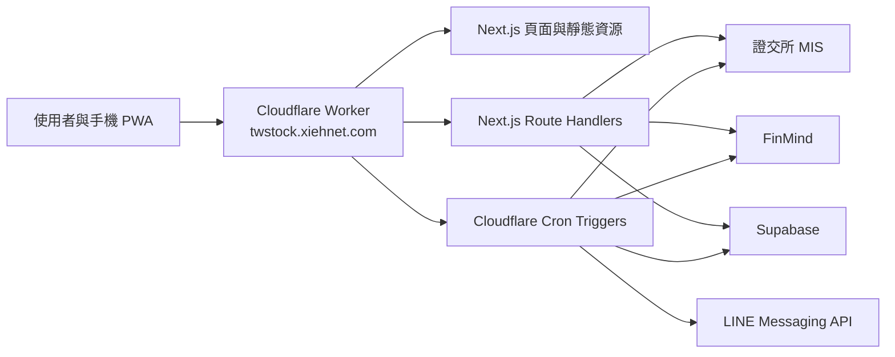

# Cloudflare Workers 全端遷移設計

日期：2026-08-15（Asia/Taipei）

## 目標

將目前由 Cloudflare Pages 提供前端、Zeabur 提供 Next.js API 與常駐排程的架構，改為單一 Cloudflare Worker 提供前端、API、排程與 LINE 通知。Supabase 保留為唯一正式資料庫。新 Worker 完成並通過驗收後，一次切換正式網域並立即停止 Zeabur；切換後若驗證失敗，只修復 Cloudflare，不重新啟用 Zeabur。

## 不在本次範圍

- 不把 Supabase 搬到 Cloudflare D1、KV 或 R2。
- 不修改或刪除既有 Supabase 資料表、欄位與正式資料；只允許新增排程鎖定所需的獨立結構。
- 不更換 TWSE、FinMind 或 LINE Messaging API。
- 不重新設計使用者介面或新增股票功能。
- 不在切換當下永久刪除 Zeabur；先停止服務，永久刪除另行確認。
- 不刪除既有 `frontend/`，直到正式切換完成並另行確認。

## 目標架構

根目錄 Next.js 15 專案透過 `@opennextjs/cloudflare` 轉換後部署到 Cloudflare Workers。自訂 Worker 入口重用 OpenNext 產生的 `fetch` handler，並另外提供 `scheduled` handler。靜態資源由 Workers Static Assets 提供，動態頁面、Middleware 與 `/api/*` 由同一個 Worker 處理。

`twstock.xiehnet.com` 最終直接綁定新 Worker，不再經過目前 `frontend/functions/api/[[path]].ts` 到 Zeabur 的代理。

## 資料與儲存

Supabase 是唯一正式資料庫，保留既有 schema 與資料，不執行資料搬移。唯一新增的資料庫結構是獨立的排程鎖定／執行紀錄表與原子取得鎖定所需的資料庫函式；不得修改或刪除既有表、欄位與資料。正式 Worker 必須具備 `NEXT_PUBLIC_SUPABASE_URL` 與 `SUPABASE_SERVICE_ROLE_KEY`；缺少任一設定時，部署驗證或詳細健康檢查必須明確失敗，不得悄悄改用本機檔案。

`lib/store.ts`、`lib/klineStore.ts` 與 `lib/fundamentalStore.ts` 的檔案模式只保留給本機開發。Cloudflare Workers 的虛擬檔案系統不作正式持久儲存。

MIS Session Cookie、K 線快取、基本面快取、提醒狀態、排程鎖定與執行紀錄均儲存在 Supabase。不得新增第二套正式資料來源。

## 排程設計

原本 `instrumentation-node.ts` 的 `node-cron` 不會帶入 Worker。排程由 Cloudflare Cron Triggers 呼叫自訂 Worker 的 `scheduled()`，並根據 `event.cron` 分派既有業務函式。

| 工作 | Cloudflare Cron（UTC） | 台北時間 | 行為 |
| --- | --- | --- | --- |
| 到價提醒 | `* * * * 1-5` | 工作日每分鐘 | 先判斷台股是否盤中，盤外立即結束 |
| 收盤總覽 | `35 5 * * 1-5` | 工作日 13:35 | 再確認實際交易日，假日不發送 |
| K 線補資料 | `0 9 * * 1-5` | 工作日 17:00 | 逐檔補抓並寫入執行結果 |
| Supabase keep-alive | `30 4 * * 0,6` | 週末 12:30 | 執行輕量資料庫查詢 |

目前 `alertsRunning` 是單一 Node 程序內的記憶體旗標，無法在分散式 Worker 中防止重複執行。遷移後新增獨立的 Supabase 排程鎖定／執行紀錄表，並透過資料庫函式原子取得租約。鎖定必須有唯一工作名稱、執行識別碼及過期時間，只有取得租約的 Worker 可以執行；Worker 中途失敗後，下一次排程可在租約到期後接手。提醒仍維持「LINE 成功後才寫入 hit timestamp」的既有語意。

每項排程記錄開始時間、完成時間、成功或失敗、處理筆數與安全化錯誤摘要，供詳細健康檢查與 Workers Logs 使用。紀錄不得包含 access token、service role key、Cookie 或完整第三方回應。

## 環境變數與 Secrets

以下敏感資料放入 Cloudflare Worker Secrets，不寫入 `wrangler.jsonc`、GitHub 原始碼或建置輸出：

- `SUPABASE_SERVICE_ROLE_KEY`
- `FINMIND_TOKEN`
- `LINE_CHANNEL_ACCESS_TOKEN`
- `LINE_TARGET_USER_ID`
- `APP_ACCESS_PASSWORD`
- `HEALTH_DETAIL_TOKEN`

`NEXT_PUBLIC_SUPABASE_URL` 需同時在 Next.js 建置環境與 Worker runtime 提供。`APP_BASE_URL` 設為 `https://twstock.xiehnet.com`。GitHub Actions 只保存部署所需的 Cloudflare API token 與 account ID，不複製應用程式 secrets。

## API 與錯誤處理

既有 Next.js Route Handlers、回應格式與前端呼叫路徑保持不變。TWSE、FinMind、Supabase 或 LINE 暫時失敗時：

- 對外沿用既有安全化錯誤格式，不回傳內部例外或 secrets。
- 報價沿用既有 stale 快取策略；沒有可用快取時才回傳失敗。
- LINE 不作無限重試，且只在成功傳送後標記提醒已觸發。
- 排程單次失敗不得阻止下一次 Cron 執行。
- `/api/health` 保持公開且只回傳輕量資訊；`?detail=1` 繼續要求 Bearer token 或合法登入 Cookie。

## 建置與部署

新增 OpenNext、Wrangler、自訂 Worker 入口、Cloudflare 設定與對應 npm scripts。GitHub `main` 仍為部署來源；既有 Cloudflare Pages workflow 改為建置並部署單一 Worker。正式切換前先部署預覽版本，不覆蓋 `twstock.xiehnet.com`。

Worker 使用 Cloudflare Workers Paid。部署後必須檢查壓縮後 bundle 小於 Workers Paid 方案限制，並確認 CPU、subrequest、記憶體與 Cron 執行時間沒有超限。

## 驗收條件

切換正式網域前必須全部通過：

1. `npm test` 全數通過。
2. `npm run build` 成功。
3. OpenNext Worker build 成功，且 bundle 在 Cloudflare 限制內。
4. 以 `workerd` 預覽實測首頁、登入、搜尋、自選股、個股、提醒頁與 PWA 資源。
5. 實打健康檢查、報價、K 線、基本面、自選股與摘要 API。
6. 透過預覽 Worker 驗證 Supabase 讀取及可回復的測試寫入。
7. 實際發送一則可辨識的 LINE 測試訊息，不能誤標為正式到價提醒。
8. 手動觸發四類排程並確認執行紀錄、鎖定與去重行為。
9. 在台股盤中由 Worker 連續執行行情 smoke test，確認 TWSE Session Cookie、限流與 Cloudflare 出口網路可用。
10. 檢查 Workers Logs，沒有未處理錯誤或 secrets 洩漏。
11. 使用桌面與手機尺寸實際開啟預覽網站，確認頁面正常渲染與核心互動可用。

今天是非交易日，因此盤中 smoke test 必須等待下一個交易時段完成，不能以週末 HTTP 200 取代。

## 一次性正式切換

所有驗收通過後，依序執行：

1. 暫停會互相競爭的自動部署，記錄 Zeabur 與 Cloudflare 當下版本。
2. 將 `twstock.xiehnet.com` 綁定至新 Worker。
3. 實測正式網域頁面、API、Supabase 讀寫與 LINE。
4. 正式驗證成功後立即停止 Zeabur，不設並行觀察期。
5. 若正式站驗證失敗，不重新啟用 Zeabur，直接修復 Cloudflare；接受切換期間可能短暫中斷。
6. Cloudflare 正式站恢復並完成驗收後，再由使用者另行決定是否永久刪除 Zeabur 服務與其環境變數。

## 回復與風險處理

本次沒有回切 Zeabur 的營運回復路徑。程式回復依靠 Cloudflare Worker 版本回滾與 Git commit；資料回復依靠 Supabase 既有資料及備份能力。Supabase 只執行新增排程鎖定結構的 migration；任何修改或刪除既有 schema、搬移或破壞正式資料的操作都不在本次範圍。

主要風險與處理方式：

- **TWSE 在 Cloudflare 出口不穩定：** 切換前於交易時段實測；未通過不得切換。
- **Worker CPU 或 bundle 超限：** 使用 Paid 方案並在預覽建置與 logs 量測；超限時先縮小 bundle 或拆分耗時工作，不降低驗收標準。
- **Cron 重複執行：** 使用 Supabase 原子鎖定及既有 hit timestamp 去重。
- **Secrets 遺漏：** 預覽與正式環境分別執行 secrets presence 檢查；不得輸出 secret 值。
- **單次切換中斷：** 只在所有預覽驗收通過後切換；失敗時直接修復或回滾 Cloudflare Worker 版本。

## 完成定義

當 `twstock.xiehnet.com` 的頁面、API、Supabase、盤中報價、四類排程與 LINE 通知全部由單一 Cloudflare Worker 正常提供，正式驗收通過且 Zeabur 已停止，才可宣稱遷移完成。永久刪除 Zeabur 不包含在本次完成定義內。
